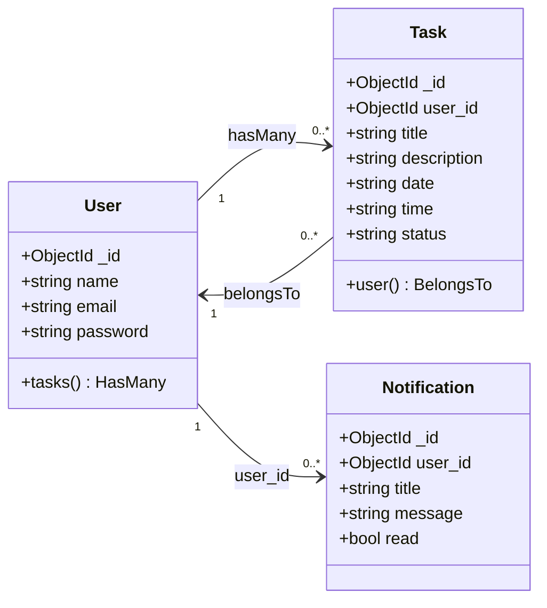
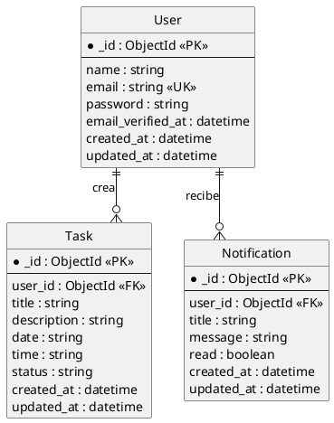

# Diagrama Entidad-Relación — TaskFlow

Proyecto Laravel + MongoDB con 3 colecciones: `users`, `tasks`, `notifications`.

## Diagrama ER (Mermaid)

```mermaid
erDiagram
    USER ||--o{ TASK : crea
    USER ||--o{ NOTIFICATION : recibe

    USER {
        ObjectId _id PK
        string name
        string email UK
        string password
        datetime email_verified_at
        datetime created_at
        datetime updated_at
    }

    TASK {
        ObjectId _id PK
        ObjectId user_id FK
        string title
        string description
        string fecha
        string hora
        string status
        datetime created_at
        datetime updated_at
    }

    NOTIFICATION {
        ObjectId _id PK
        ObjectId user_id FK
        string title
        string message
        boolean leido
        datetime created_at
        datetime updated_at
    }
```

## Diagrama de clases (Mermaid)

## Versión PlantUML (si usas @startuml)

## Cardinalidades

| Relación | Cardinalidad | Descripción |
|----------|--------------|-------------|
| User → Task | 1 : N | Un usuario crea muchas tareas |
| User → Notification | 1 : N | Un usuario recibe muchas notificaciones |

## Dónde renderizarlo

| Formato | Herramienta |
|---------|-------------|
| Mermaid | https://mermaid.live · VS Code (ext. *Markdown Preview Mermaid Support*) · GitHub |
| PlantUML | https://www.plantuml.com/plantuml/uml · VS Code (ext. *PlantUML* de jebbs) |
